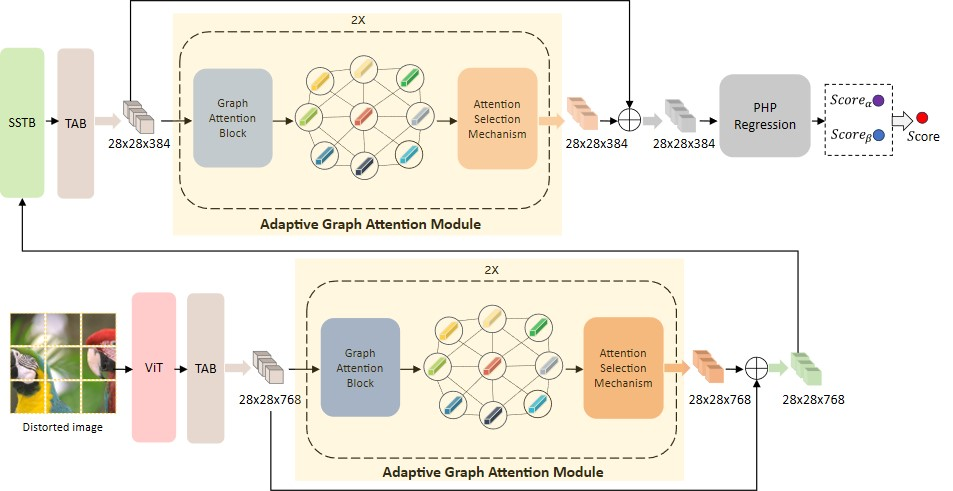

# AGAIQA: Blind Image Quality Assessment via Adaptive Graph Attention

[Link to the paper](https://ieeexplore.ieee.org/document/10539107)

## Abstract
Recent advancements in blind image quality assessment (BIQA) are primarily propelled by deep learning technologies. While leveraging transformers can effectively capture long-range dependencies and contextual details in images, the significance of local information in image quality assessment can be undervalued. To address this challenging problem, we propose a novel feature enhancement framework tailored for BIQA. Specifically, we devise an Adaptive Graph Attention (AGA) module to simultaneously augment both local and contextual information. It not only refines the post-transformer features into an adaptive graph, facilitating local information enhancement, but also exploits interactions amongst diverse feature channels. The proposed technique can better reduce redundant information introduced during feature updates compared to traditional convolution layers, streamlining the self-updating process for feature maps. Experimental results show that our proposed model outperforms state-of-the-art BIQA models in predicting the perceived quality of images. The code of the model will be made publicly available.

## Network Architecture


## **USAGE**
```sh
python train.py
```

## **Requirements**
```sh
pip install -r requirements.txt
```

## **Citation**
```sh
@ARTICLE{10539107,
  author={Wang, Huasheng and Liu, Jiang and Tan, Hongchen and Lou, Jianxun and Liu, Xiaochang and Zhou, Wei and Liu, Hantao},
  journal={IEEE Transactions on Circuits and Systems for Video Technology}, 
  title={Blind Image Quality Assessment via Adaptive Graph Attention}, 
  year={2024},
  volume={},
  number={},
  pages={1-1},
  keywords={Transformers;Image quality;Feature extraction;Adaptation models;Predictive models;Deep learning;Task analysis;Image quality assessment;no-reference;graph;convolutional neural networks;deep learning},
  doi={10.1109/TCSVT.2024.3405789}}
```

## **Acknowledgment**
Our codes partially borrowed from [MANIQA](https://ieeexplore.ieee.org/document/10539107)
